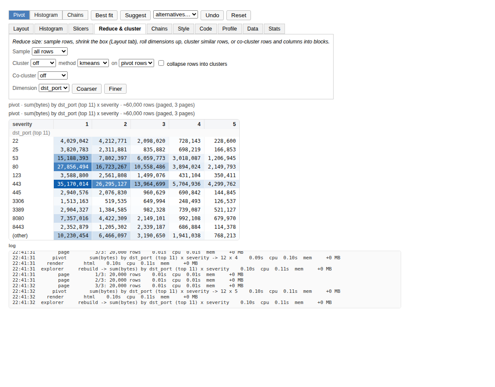

# pivot2hist

Auto-fitted pivot tables that toggle to histograms and back, with slicing, clustering and
Jupyter menus. Built for cyber logs (firewall, auth, DNS, EDR ...) but the type guessing is
generic, so it works on any tabular data.

```
pip install pivot2hist                       # pandas + numpy only
pip install "pivot2hist[jupyter]"            # + ipywidgets for the interactive explorer
pip install "pivot2hist[parquet,duckdb]"     # + pyarrow / duckdb sources (surveyed and paged)
pip install "pivot2hist[cluster]"            # + scikit-learn for real HDBSCAN
```

```python
import pivot2hist as p2h

v = p2h.fit("firewall.csv")        # a DataFrame, path, list of dicts ... anything tabular
v                                  # notebook: heatmap pivot, best fit for a 40 x 12 box
v.toggle()                         # the same table as an SVG histogram; toggle() again returns
v.slice(action="deny")             # slices stack, show in the title and survive toggling
v.histogram("bytes", by="action")  # one column, nice log bins, one series per action
v.suggest()                        # the auto-guess menu: alternative layouts, best first
v.cluster(4)                       # group similar rows with k-means
v.coarser("src_ip")                # 10.0.1.5 -> 10.0.1.0/24 -> 10.0.0.0/16
p2h.explore(df)                    # Jupyter menus for all of the above
p2h.fit("huge.parquet")            # surveyed against your RAM; fitted on a sample, aggregated page by page
p2h.chains(df, "event", by="user", time="timestamp")   # Markov transition matrix as a pivot
p2h.verbose(); p2h.stats(7)        # scrolling step log; the seven costliest steps
```

Shell: `pivot2hist firewall.csv --slice action=deny --hist --on bytes --by dst_port`,
`pivot2hist --demo firewall`.

## Type guessing

`p2h.profile(df)` classifies every column before anything is fitted:

| kind | examples | used as |
| --- | --- | --- |
| `categorical` | action, protocol, `dst_port` (a number that is a label), src_ip | dimension |
| `numeric` | bytes, duration, score | measure, or binned dimension |
| `datetime` | timestamp, ISO strings, epoch seconds/millis in time-named columns | time buckets |
| `boolean` | flags, `0/1`, yes/no strings | dimension |
| `id` | session ids, uuids, hashes | avoided |
| `constant` | one value | ignored |

On top of the storage kind, values are matched against **semantic types** (a from-scratch,
regex-on-a-sample inference in the spirit of relation-based type systems used by pandas
profilers): `ipv4`, `ipv6`, `mac`, `email`, `url`, `domain`, `path`, `uuid`, `hash`, `port`.
Each unlocks a **drill hierarchy** that the fit, `coarser()`/`finer()`/`level()` and the
explorer use:

| semantic | levels (coarse -> fine) |
| --- | --- |
| ipv4 | `/8`, `/16`, `/24`, host |
| port | class (well-known / registered / ephemeral), port |
| url | host, path, full |
| email | domain, full |
| domain | site (`google.co.uk`), full |
| path | top dir, dir, full |
| datetime | year ... minute, plus cyclic `hour_of_day`, `weekday`, `month_of_year` |

Time series are detected too: a datetime column sampled at a mostly regular interval marks
the frame as a time series (`profile.is_time_series`, `ts_freq`), which makes the fit prefer
time down the side and `mean(<reading>)` as the measure.

The loader (`p2h.load`) also turns numeric strings (`"1,024"`), yes/no strings and epoch
integers into proper types, keeps zip-code-like strings as text, makes a `DatetimeIndex`
a column, and never copies a frame unless a column actually changes.

## Auto-fit: ratio and dimensions

`fit()` decides the layout for you:

1. **Measure**: the sum of an additive-looking numeric column (`bytes`, `count`, `amount`,
   `revenue` ...), the mean of the best reading for a time series, else the row count.
2. **Level budgets** so the table fits the box (`max_rows` x `max_cols`, default 40 x 12):
   top-N + "(other)" for high-cardinality labels, semantic roll-ups (`/24` instead of "top 39
   IPs"), nice 1/2/2.5/5 numeric bins (log-spaced 1-2-5 bins on heavy tails), time buckets
   from minute to year.
3. **Search** over row/column assignments of up to `layers` dimensions per axis, including
   the semantic and cyclic-time variants. Every candidate is scored on a sample by the
   entropy of its cells (many, evenly used cells), the mutual information between its axes
   (tables that show structure), sparsity, distance from the target `aspect`, extra layers,
   mass hidden in "(other)", and pivot-shaped priors (entities such as IPs, hosts and users
   down the side; small categories across the top).

```python
p2h.fit(df, max_rows=20, max_cols=6, layers=1, aspect=4)
p2h.fit(df, rows=["src_ip"], cols=["action"])                 # fix axes, auto-pick the rest
p2h.fit(df, rows=[{"column": "src_ip", "level": "/24"}], cols=[{"column": "timestamp", "freq": "hour_of_day"}])
p2h.fit(df, rows=[{"column": "bytes", "bins": 6}, "action"], agg="count")
p2h.fit(df, pin=["country"])                                  # must appear somewhere
p2h.fit(df, prefer_rows=["timestamp"], prefer_cols=["action"])
p2h.fit(df, weights={"layers": 2.0, "mutual_info": 4.0})      # re-weight the score
p2h.fit(df, bins="kmeans")                                    # density-driven natural breaks
p2h.suggest(df, 5)                                            # ranked alternatives
```

Every scoring term and its default weight is in `p2h.DEFAULT_WEIGHTS`.

Example (`p2h.sample.firewall_logs()`, `max_rows=8, max_cols=5`, text rendering):

```
pivot · sum(bytes) by dst_port (top 7) x severity · 5,000 rows
severity                  1          2        3        4        5
dst_port (top 7)
22                  363,529    410,430   76,948   24,709   11,004
53                  942,479    792,997  638,339  148,153   26,825
80                2,613,591  1,031,321  811,617  312,231  168,930
443               2,837,046  2,901,985  758,086  430,486  570,214
445                 465,295    250,694   53,423   28,583   12,484
3389                 85,024    205,255  183,516   14,443   16,613
8080                431,607    305,602  159,732   30,346   31,373
(other)           1,774,343    846,769  526,193  215,861  148,340
```

In a notebook the same view is a heatmap table (per-table, per-column or per-row colour
scale, optional in-cell bars and totals) and the histogram is an SVG bar chart with
tooltips, legends, grouped bars for multi-layer rows, optional stacking and a KDE density
curve over numeric bins. Both are plain HTML/SVG: no JS, no widget extension, they render
in Jupyter, Lab, VS Code, Colab, nbviewer and on GitHub.

```python
v.style(heat="column", totals=True, bars=True)     # pivot look
v.toggle().style(stacked=True, log_y=True)          # histogram look
v.html(); v.svg()                                    # the markup, if you want it
```

## Multi-layer

Both axes stack dimensions; budgets are planned jointly so the product fits the box:

```
pivot · count by severity > action x protocol · 5,000 rows
protocol           TCP  UDP ICMP
severity action
1        allow   1,447  339   45
2        allow     890  211   22
         deny      304   18   13
...
```

`v.layers(1)`, `v.layers(3)`, `v.fit_to(20, 6)` refit with a different depth or box.

## Toggle to histogram and back

`toggle()` flips the *same* layout: rows become bins, columns become series, and toggling
again gives the pivot back with any slices added in the meantime.

```
hist · count by bytes (bins) · 5,000 rows
bytes (bins)  count
[0, 1)        ▋                                                             20
[1, 10)       █████▎                                                       174
[10, 100)     ███████████████████████▎                                     777
[100, 1K)     ██████████████████████████████████████████████████████████ 1.94K
[1K, 10K)     █████████████████████████████████████████████████▉         1.66K
[10K, 100K)   ████████████▎                                                407
[100K, 1M]    ▊                                                             23
```

```python
v.histogram("bytes")                          # count per nice (log) bin, KDE overlay in HTML
v.histogram("bytes", bins=8, scale="linear")
v.histogram("bytes", bins="kmeans")           # natural breaks: one bin per mode
v.histogram("bytes", bins="quantile")         # equal-frequency bins
v.histogram("bytes", by="action", values="bytes", agg="sum")
v.histogram("timestamp")                      # events over time
v.histogram("dst_port")                       # top-N bars for labels
```

Bin rules: `auto` (Freedman-Diaconis clamped to [Sturges, 4 x Sturges]), `fd`, `sturges`,
`scott`, `sqrt`, `rice`, `kmeans`, `quantile`, or an integer.

## Super slicing

Slices are filters that stack, show up in the title, and carry across toggles and refits.

```python
v.slice(action="deny")                        # equality
v.slice(dst_port=[22, 3389])                  # membership
v.slice(bytes=(1000, 50000))                  # range [lo, hi)
v.slice(bytes=">= 1000")                      # == != > >= < <=
v.slice(bytes=">= p95")                       # percentiles
v.slice(timestamp="last 24h")                 # relative time: 30min, 2h, 7d, 1w ...
v.slice(timestamp="2026-03-02")               # a day; "2026-03" a month; "2026" a year
v.slice(src_ip="~^10\\.0\\.1\\.")               # regex
v.slice(bytes=lambda s: s > s.median())       # callable
v.slice("bytes > 1000 and action == 'deny'")  # pandas query
v.exclude(action="allow")                     # the complement
v.top("src_ip", 10)                           # heaviest values only (by count, or by="bytes")
v.drill(dst_port=443)                         # slice + refit: zoom into a cell
v.unslice("action"); v.unslice()              # drop one / all
v.slicers()                                   # {column: [(value, count), ...]}
```

If a slice collapses a dimension to one value, the layout is refit automatically
(`refit=False` keeps it, `refit=True` always refits on the sliced data).

## Reduce size and cluster

```python
v.coarser("src_ip"); v.finer("src_ip")        # walk the drill hierarchy / time buckets / bin counts
v.level("timestamp", "hour_of_day")           # hour-of-day x weekday heatmaps are one call away
v.fit_to(10, 4)                               # a smaller box
v.sample(10_000)                              # the same view over a random sample
v.cluster(4)                                  # k-means on the pivot rows' column profiles:
                                              #   similar rows grouped under a cluster level
v.cluster(4, collapse=True)                   # ... or collapsed into 4 rows
v.cluster(on=["bytes", "duration"])           # k-means on records, auto k by silhouette
p2h.cluster(df, ["bytes", "duration"], k=3)   # just the frame with a cluster column
```

Clustering is numpy k-means++ with an automatic k (centroid silhouette); no scikit-learn
needed. Row profiles are compared as proportions so a busy and a quiet port with the same
allow/deny mix land together.

## Big data: survey first, then page

Files and DuckDB sources are **surveyed** before anything is loaded: rows (exact from
Parquet/DuckDB metadata, estimated for CSV/JSONL), size on disk, bytes per row calibrated
on a probe, the estimated in-memory size, and the machine (RAM total/available, including
cgroup limits inside containers, CPU count, load, this process's footprint). A **plan**
follows from the memory budget (default: half the available RAM):

| verdict | plan | what happens |
| --- | --- | --- |
| fits | `full` | load everything |
| tight | `downcast` | load everything, then repetitive text -> category, ints -> smallest width, float64 -> float32 |
| choke | `paged` | fit on a sample (spread across Parquet row groups / a DuckDB reservoir sample); aggregate page by page |

```python
p2h.survey("events.parquet")                       # the report, no loading
p2h.fit("events.parquet")                          # auto plan
p2h.fit("events.csv", memory_budget_mb=2000)       # your budget
p2h.fit("events.parquet", mode="paged", page_rows=500_000, columns=["ts", "src_ip", "action", "bytes"])
p2h.fit("duckdb://logs.duckdb?table=events")       # or a connection: p2h.fit(con, query="SELECT ...")
```

Paged views behave like any other: `toggle`, `slice`, `histogram`, `suggest`, `cluster`
and `cocluster` all work, with `count`, `sum`, `min`, `max` and `mean` **exact** across
pages (`mean` is combined from sums and counts) and top-N buckets frozen from the sample
so every page folds the same way. `median`, `std` and `nunique` fall back to the sample
and say so in the title. `v.sample(n)` and `v.materialize()` give in-memory views when you
want the rest (record clustering, plotting).

```
survey       parquet: 400,000 rows, ~52 MB -> choke, paged    0.11s  cpu  0.15s  mem    +50 MB
plan         paged: 9 pages of 46,218 rows, fit on a 92,436-row sample; ~52 MB exceeds the 40 MB budget
sample       92,436 rows, 12 MB    0.34s  cpu  0.54s  mem    +80 MB
fit          92,436 rows x 11 cols -> sum(bytes) by dst_ip (top 39) x rule    2.31s  cpu  2.31s  mem     +5 MB
  page         1/9: 46,218 rows    0.02s  cpu  0.02s  mem     +0 MB
  page         2/9: 46,218 rows    0.01s  cpu  0.01s  mem     +0 MB
  page         ... 6 more pages
  page         9/9: 30,256 rows    0.01s  cpu  0.01s  mem     +0 MB
pivot        sum(bytes) by dst_ip (top 39) x rule -> 40 x 8    0.71s  cpu  0.88s  mem    +44 MB
```

## Log and stats

`p2h.verbose()` prints every major step (survey, plan, sample, pages, fit, pivot, cluster,
render ...) to stderr as it finishes, with wall time, CPU time and the memory delta.
`p2h.log.tail(12)` gives the last lines, `p2h.log.listen(fn)` streams them to your own
sink (the explorer's log panel is one). `p2h.stats(7)` (or `v.stats()`) is the report of
the seven costliest kinds of step: calls, total seconds, CPU seconds, peak memory delta,
last detail.

## Matrices and chains

```python
v = p2h.chains(df, "event", by="user", time="timestamp")     # rows = from, cols = to, counts
p2h.chains(df, "event", by="user", time="timestamp", normalize=True)   # row probabilities
p2h.chains(df, "dst_port", by="src_ip", time="timestamp", order=2)     # conditioned on the previous two
p2h.sequences(df, "event", by="user", time="timestamp", length=3, n=10) # most frequent 3-step chains
p2h.steady_state(p2h.transition_matrix(df, "event", by="user"))         # stationary distribution
```

Transitions never cross an entity (`by`); the result is an ordinary pivot, so
`toggle()`, slices, `cocluster()` and the heatmap all apply. For an auth log the chains
tab shows `login_failure → login_failure → login_success` with the number of users it
happened to.

**Co-clustering** groups rows *and* columns of any pivot into matching blocks and makes
the block structure visible on the heatmap: `v.cocluster()` (spectral co-clustering of the
normalised matrix, block count from the eigengap) or `v.cocluster(method="mcl")` (Markov
clustering: random walks on the bipartite row-column graph, expansion and inflation until
they settle). `nest=False` only reorders the axes instead of adding block levels.

## Density clustering

`method="dbscan"` clusters by density with an automatic radius (knee of the k-distance
curve); outliers become a `noise` label, which is what you want for scanners and odd
hosts. `method="hdbscan"` uses scikit-learn's HDBSCAN (or the `hdbscan` package) when
installed and falls back to DBSCAN with a note in the log otherwise.

```python
v.cluster(method="dbscan")                     # pivot rows; noise rows grouped apart
v.cluster(on=["bytes", "duration"], method="hdbscan")
p2h.cluster(df, ["bytes", "duration"], method="dbscan")
```

## Jupyter explorer

```python
p2h.explore(df)                                  # or v.explore(); files/DuckDB are surveyed and paged
```

An ipywidgets app: Pivot / Histogram / Chains toggle, **Best fit**, **Suggest** (ranked
alternatives in a dropdown), Undo/Reset, and tabs for Layout (rows, columns, values, agg,
layers, box, bin rule, scale, order), Histogram (on, by, bins, stacked, density, log y),
Slicers (multi-selects for labels, percentile range sliders for numbers, date ranges, a
query box, top-N), Reduce & cluster (sample, cluster k / method / on / collapse,
co-cluster, coarser / finer), Chains (state, entity, time, probabilities, plus the most
frequent 3-step chains), Style, Code (the Python reproducing the current view), Profile,
Data (the survey and plan) and Stats (the seven costliest steps). A scrolling log of major
steps sits under the output. `explorer.snapshot_html()` renders a static picture of the
interface for docs or sharing.




## Loading data

`p2h.load()` accepts a DataFrame or Series, a file path (csv, tsv, json, jsonl, parquet,
xlsx, feather, optionally compressed), a list of dicts, a dict of lists or a 2-D numpy
array. Text timestamps, epoch integers, numeric strings and yes/no strings are converted
(`parse_dates=False`, `infer_types=False` to skip).

## CLI

```
pivot2hist FILE [--hist] [--on COL] [--by COL,COL] [--bins N|rule] [--scale auto|linear|log]
                [--rows COL,COL] [--cols COL,COL] [--values COL] [--agg sum|mean|...] [--count]
                [--max-rows N] [--max-cols N] [--layers N] [--aspect R]
                [--slice COL=VAL]... [--where EXPR]
                [--survey] [--budget MB] [--mode auto|full|downcast|sample|paged] [--columns A,B] [--page-rows N]
                [--table T | --query SQL]   (duckdb://db.duckdb sources)
                [--chains STATE --by ENTITY --time COL]
                [-v] [--stats] [--json | --csv | --layout | --profile | --slicers] [--width N] [--ascii]
pivot2hist --demo firewall|auth
cat data.csv | pivot2hist -
```

## Options

| option | default | meaning |
| --- | --- | --- |
| `max_rows`, `max_cols` | 40, 12 | the box the pivot must fit |
| `layers` | 2 | max stacked dimensions per axis |
| `aspect` | box ratio | target rows/cols ratio (explicit values are weighted strongly) |
| `max_sparsity` | 0.6 | empty-cell fraction tolerated before a layout is penalised |
| `max_bins` | 30 | bin cap for `histogram()` |
| `bins` | `"auto"` | bin rule for numeric dimensions |
| `scale` | `"auto"` | `"linear"` / `"log"` numeric bins |
| `order` | `"auto"` | level order: natural for numbers/time, by frequency for text |
| `variants` | `True` | try semantic roll-ups and cyclic time buckets as dimensions |
| `pin`, `prefer_rows`, `prefer_cols` | `()` | must-use columns, axis preferences |
| `weights` | `{}` | overrides for `DEFAULT_WEIGHTS` |
| `sample` | 50000 | rows used to score candidates (the table always uses all rows) |
| `search_width` | 7 | columns entering the search (time, pinned and preferred always do) |
| `exclude` | `()` | columns never used |
| `max_categories`, `discrete_max`, `id_ratio` | 50, 20, 0.5 | profiling thresholds |

## Performance

Everything is pandas/numpy; candidate layouts are scored on a sample and semantic
bucketing works on distinct values. On one core: 5k rows fit in ~0.3 s, 300k in ~3.5 s,
1M rows fit + pivot in ~13 s in memory; larger sources stream through pages at roughly
1 s per million rows per aggregation, using memory for one page at a time. A Rust
extension was considered and skipped: the hot paths are already C (pandas groupby, numpy
unique, DuckDB's engine for DuckDB sources) and the search is bounded by sampling.

## Development

```
pip install -e ".[dev,jupyter]"
pytest
```
