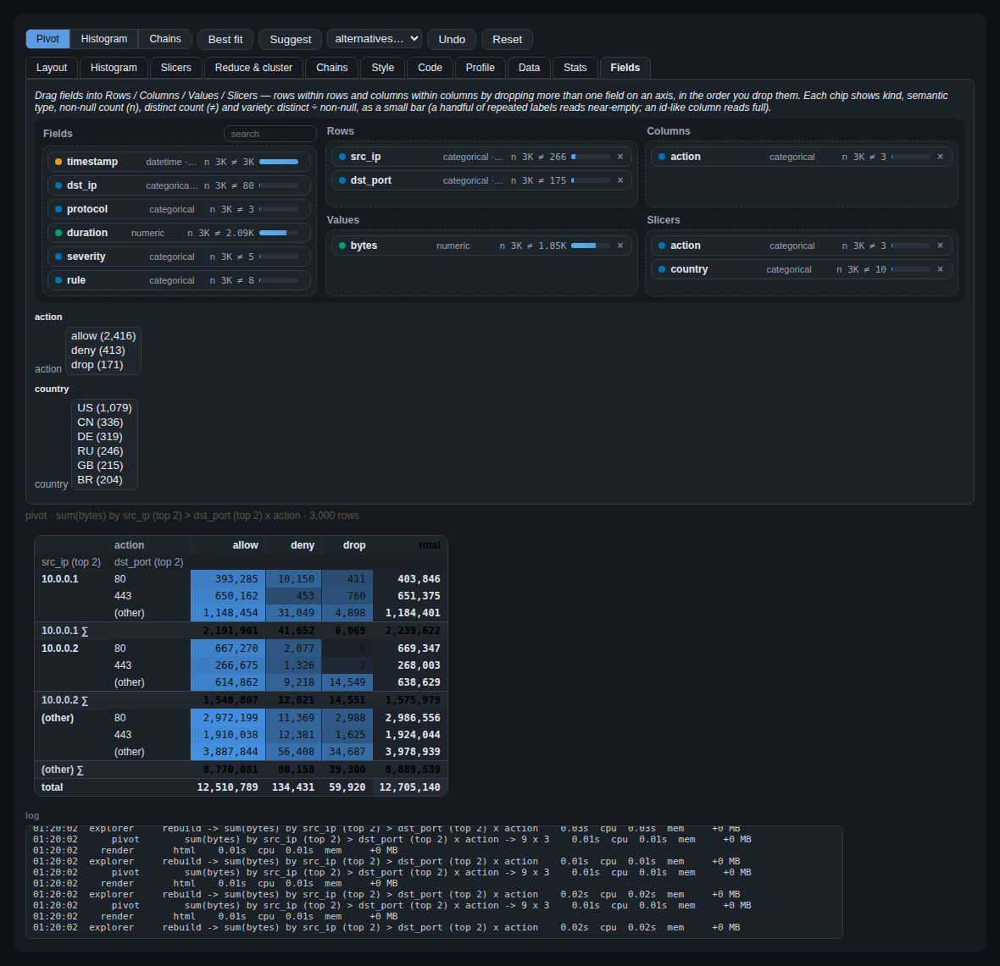
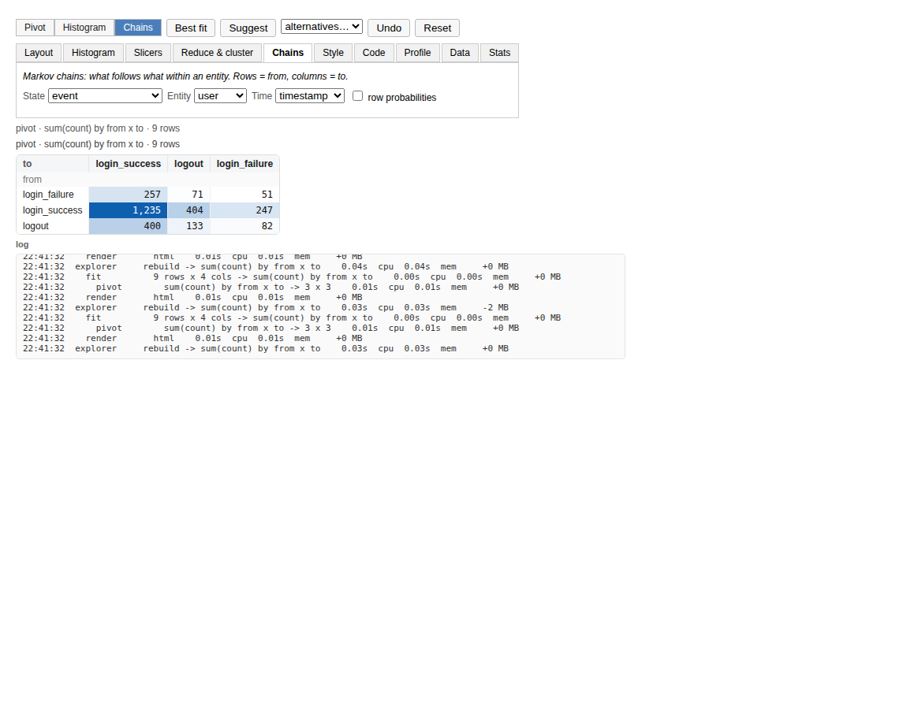
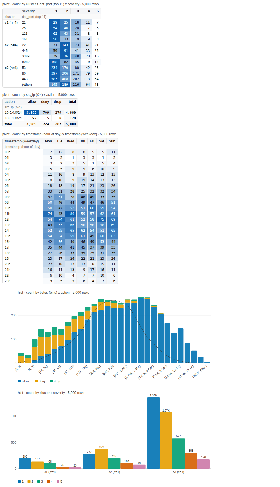

# pivot2hist

Auto-fitted pivot tables that toggle to histograms and back, with slicing, clustering,
a draggable field list, a dark modern theme, an MCP server for LLM agents and Jupyter
menus. Built for cyber logs (firewall, auth, DNS, EDR ...) but the type guessing is
generic, so it works on any tabular data.

```
pip install pivot2hist                       # pandas + numpy only
pip install "pivot2hist[jupyter]"            # + ipywidgets/anywidget for the interactive explorer
pip install "pivot2hist[parquet,duckdb]"     # + pyarrow / duckdb sources (surveyed, paged, engine="duckdb")
pip install "pivot2hist[cluster]"            # + scikit-learn for real HDBSCAN
pip install "pivot2hist[mcp]"                # + an MCP server for LLM agents
```

```python
import pivot2hist as p2h

v = p2h.fit("firewall.csv")        # a DataFrame, path, list of dicts ... anything tabular
v                                  # notebook: heatmap pivot, best fit for a 40 x 12 box
v.toggle()                         # the same table as an SVG histogram; toggle() again returns
v.slice(action="deny")             # slices stack, show in the title and survive toggling
v.histogram("bytes", by="action")  # one column, nice log bins, one series per action
v.suggest()                        # the auto-guess menu: alternative layouts, scored, best first
v.cluster(4)                       # group similar rows with k-means
v.coarser("src_ip")                # 10.0.1.5 -> 10.0.1.0/24 -> 10.0.0.0/16
v.anomalies()                      # cells that break the row/column independence pattern
p2h.explore(df)                    # Jupyter menus: drag fields, pick a theme, all of the above
p2h.fit("huge.parquet")            # surveyed against your RAM; fitted on a sample, aggregated page by page
p2h.chains(df, "event", by="user", time="timestamp")   # Markov transition matrix as a pivot
p2h.regimes(df, "event", by="user", time="timestamp")  # HMM-decoded behavioural regimes, as a pivot
p2h.dependencies(df)               # which columns move together, as a pivot (mutual information)
p2h.verbose(); p2h.stats(7)        # scrolling step log; the seven costliest steps
v.llm_context()                    # description + metadata + a markdown table, sized for a model's context
v.insights()                       # rich local summary: distributions, mixtures, anomalies, ranked findings — no LLM
v.compare(action="deny")           # deny vs the rest on one shared layout: diverging heatmap, .top() movers, toggles too
v.facet("action")                  # small multiples: one panel per value, same layout, one colour scale
v.style(sparklines="timestamp")    # a trend column: one small line per row, that row's measure over time
v.rows("22", "deny")               # the raw rows behind a cell, by the labels the table shows
v.explain("22", "deny")            # why that cell: vs independence, shares, rank, and what sets its rows apart
v.prompt("What's unusual here?")   # everything on screen as one paste-anywhere LLM prompt (no model is called)
p2h.agent.pivot("firewall.csv", rows=["src_ip"], filters=[{"column": "action", "eq": "deny"}])  # plain JSON, for LLM agents
```

Shell: `pivot2hist firewall.csv --slice action=deny --hist --on bytes --by dst_port`,
`pivot2hist --demo firewall`. MCP server for any MCP client (Claude Code, Claude Desktop,
...): `pivot2hist-mcp`.

## How it works

**Program flow** — every entry point (`fit`, `explore`, the agent API, the MCP server,
the CLI) funnels through the same five steps; a `View` is immutable, so `.slice()`,
`.suggest()`, `.cluster()` and friends each return a new one instead of mutating it:

```
  entry points
  ------------
  p2h.fit / histogram / chains / regimes / dependencies(df, ...)
  p2h.explore(df)      -> Explorer (ipywidgets: drag fields, live re-fit)
  p2h.agent.*          -> plain JSON, for LLM tool-calling
  pivot2hist-mcp       -> MCP server, same operations over stdio
  CLI: pivot2hist FILE [--hist] [--slice ...] [--chains ...]
              |
              v
  +------------------------------------------------------------------+
  | 1. LOAD / SURVEY        p2h.load()  or  p2h.survey() + plan      |
  |    fits the memory budget?  --yes-->  load fully, or downcast    |
  |    too big?                 --no -->  sample + page (see below)  |
  +------------------------------------------------------------------+
              |
              v
  +------------------------------------------------------------------+
  | 2. PROFILE              p2h.profile(df)                          |
  |    kind (numeric/categorical/datetime/boolean/id/constant)       |
  |    + semantic type (ipv4, port, url, email, domain, path, ...)   |
  +------------------------------------------------------------------+
              |
              v
  +------------------------------------------------------------------+
  | 3. FIT LAYOUT            fit_layout()            (_fit.py)       |
  |    search rows x cols x layers x bins/top-N/time-freq            |
  |    score = entropy + association   [ raw mutual_info,            |
  |            - sparsity - aspect       or BIC: objective="bic" ]   |
  |            - layers + quality - "(other)" + pivot-shape priors   |
  +------------------------------------------------------------------+
              |
              v
  +------------------------------------------------------------------+
  | 4. VIEW      (source, Layout, filters, mode) - immutable, cached |
  |                                                                  |
  |    .pivot() / .bins()  -->  build_table()  -->  pandas groupby   |
  |                                             or  engine="duckdb"  |
  |    .toggle()    pivot <-> histogram, same underlying data        |
  |    .slice(...)  stack a filter -> a new View                     |
  |    .suggest()   re-run the search, ranked alternatives           |
  |    .cluster() / .cocluster()   group rows / rows and columns     |
  |    .style(...)  theme, heat, totals, subtotals, outline          |
  +------------------------------------------------------------------+
              |
              v
  +------------------------------------------------------------------+
  | 5. RENDER                                                        |
  |    str(v)               render_pivot() / render_hist()  (text)   |
  |    v.html() / v.svg()   pivot_html() / hist_svg()  (HTML/SVG)    |
  +------------------------------------------------------------------+
```

**Data flow** — how one column actually gets there, and where the analysis features
(mixtures, regimes, dependencies, anomalies, distributions, clustering) branch off the
same `View` rather than being a separate pipeline:

```
  DataFrame column
        |
        v
  profile()        kind (numeric / categorical / datetime / boolean / id / constant)
        |          + semantic type (ipv4 -> /24 -> /16, port -> class, url -> host ...)
        v
  plan_dim()        a Dim: binned (edges) | categorical (top-N + "(other)") | time (freq)
        |
        v
  materialize()      ordered categorical Series of level labels
        |            ("(other)" and "(null)" always sort last)
        v
  build_table()       group by row x col labels, aggregate the measure
        |             pandas pivot_table  -- or --  engine="duckdb" SQL
        v
  pivot table (rows x cols)  <===== .toggle() =====>  histogram table (bins x series)
        |
        +-- .style(heat=...)          --> heatmap HTML / SVG bars
        +-- .anomalies()              --> row/col independence residuals (surprise)
        +-- .distribution(col)        --> best-fit probability family, by BIC
        +-- .modes(col)               --> Gaussian-mixture peaks (component count by BIC)
        +-- p2h.regimes(state, ...)   --> HMM-decoded regime column, itself a View
        +-- p2h.dependencies(df)      --> pairwise column mutual-information, a View
        +-- .cluster() / .cocluster() --> row / row+col groups
                                          (k-means, DBSCAN, HDBSCAN, GMM, spectral, MCL)
```

## Type guessing

`p2h.profile(df)` classifies every column before anything is fitted:

| kind | examples | used as |
| --- | --- | --- |
| `categorical` | action, protocol, `dst_port` (a number that is a label), src_ip | dimension |
| `numeric` | bytes, duration, score | measure, or binned dimension |
| `datetime` | timestamp, ISO strings, epoch seconds/millis in time-named columns | time buckets |
| `boolean` | flags, `0/1`, yes/no strings | dimension |
| `id` | session ids, uuids, hashes | avoided |
| `constant` | one value | ignored |

On top of the storage kind, values are matched against **semantic types** (a from-scratch,
regex-on-a-sample inference in the spirit of relation-based type systems used by pandas
profilers): `ipv4`, `ipv6`, `mac`, `email`, `url`, `domain`, `path`, `uuid`, `hash`, `port`.
Each unlocks a **drill hierarchy** that the fit, `coarser()`/`finer()`/`level()` and the
explorer use:

| semantic | levels (coarse -> fine) |
| --- | --- |
| ipv4 | `/8`, `/16`, `/24`, host |
| port | class (well-known / registered / ephemeral), port |
| url | host, path, full |
| email | domain, full |
| domain | site (`google.co.uk`), full |
| path | top dir, dir, full |
| datetime | year ... minute, plus cyclic `hour_of_day`, `weekday`, `month_of_year` |

Time series are detected too: a datetime column sampled at a mostly regular interval marks
the frame as a time series (`profile.is_time_series`, `ts_freq`), which makes the fit prefer
time down the side and `mean(<reading>)` as the measure.

The loader (`p2h.load`) also turns numeric strings (`"1,024"`), yes/no strings and epoch
integers into proper types, keeps zip-code-like strings as text, makes a `DatetimeIndex`
a column, and never copies a frame unless a column actually changes.

## Auto-fit: ratio and dimensions

`fit()` decides the layout for you:

1. **Measure**: the sum of an additive-looking numeric column (`bytes`, `count`, `amount`,
   `revenue` ...), the mean of the best reading for a time series, else the row count.
2. **Level budgets** so the table fits the box (`max_rows` x `max_cols`, default 40 x 12):
   top-N + "(other)" for high-cardinality labels, semantic roll-ups (`/24` instead of "top 39
   IPs"), nice 1/2/2.5/5 numeric bins (log-spaced 1-2-5 bins on heavy tails), time buckets
   from minute to year.
3. **Search** over row/column assignments of up to `layers` dimensions per axis, including
   the semantic and cyclic-time variants. Every candidate is scored on a sample by the
   entropy of its cells (many, evenly used cells), the mutual information between its axes
   (tables that show structure), sparsity, distance from the target `aspect`, extra layers,
   mass hidden in "(other)", and pivot-shaped priors (entities such as IPs, hosts and users
   down the side; small categories across the top).

```python
p2h.fit(df, max_rows=20, max_cols=6, layers=1, aspect=4)
p2h.fit(df, rows=["src_ip"], cols=["action"])                 # fix axes, auto-pick the rest
p2h.fit(df, rows=[{"column": "src_ip", "level": "/24"}], cols=[{"column": "timestamp", "freq": "hour_of_day"}])
p2h.fit(df, rows=[{"column": "bytes", "bins": 6}, "action"], agg="count")
p2h.fit(df, pin=["country"])                                  # must appear somewhere
p2h.fit(df, prefer_rows=["timestamp"], prefer_cols=["action"])
p2h.fit(df, weights={"layers": 2.0, "mutual_info": 4.0})      # re-weight the score
p2h.fit(df, bins="kmeans")                                    # density-driven natural breaks
p2h.fit(df, objective="bic")                                  # BIC scoring, see below
p2h.suggest(df, 5)                                            # ranked alternatives
```

Every scoring term and its default weight is in `p2h.DEFAULT_WEIGHTS`.

**Objective**: `objective="bic"` swaps the raw mutual-information term for a proper
model-selection question - is this layout's row/column association strong enough to be
worth the table's own complexity? It's the classical BIC comparison of the saturated
table against independence, per observation: the log-likelihood-ratio/G-test statistic
(`2 * mutual_info`) minus the table's extra degrees of freedom over independence
(`(rows - 1) * (cols - 1)`) at the usual `log(n)` cost each. The same mutual information
is worth far less on a 30x10 table than on a 3x3 one, so `"bic"` tends to prefer more
parsimonious layouts on smaller samples and gets more permissive as evidence accumulates.
Every other scoring term (sparsity, aspect, layers, priors ...) is unchanged; the default
stays `"heuristic"`.

Example (`p2h.sample.firewall_logs()`, `max_rows=8, max_cols=5`, text rendering):

```
pivot · sum(bytes) by dst_port (top 7) x severity · 5,000 rows
severity                  1          2        3        4        5
dst_port (top 7)
22                  363,529    410,430   76,948   24,709   11,004
53                  942,479    792,997  638,339  148,153   26,825
80                2,613,591  1,031,321  811,617  312,231  168,930
443               2,837,046  2,901,985  758,086  430,486  570,214
445                 465,295    250,694   53,423   28,583   12,484
3389                 85,024    205,255  183,516   14,443   16,613
8080                431,607    305,602  159,732   30,346   31,373
(other)           1,774,343    846,769  526,193  215,861  148,340
```

In a notebook the same view is a heatmap table (per-table, per-column or per-row colour
scale, optional in-cell bars and totals) and the histogram is an SVG bar chart with
tooltips, legends, grouped bars for multi-layer rows, optional stacking and a KDE density
curve over numeric bins. Both are plain HTML/SVG: no JS, no widget extension, they render
in Jupyter, Lab, VS Code, Colab, nbviewer and on GitHub.

```python
v.style(heat="column", totals=True, bars=True)     # pivot look
v.toggle().style(stacked=True, log_y=True)          # histogram look
v.html(); v.svg()                                    # the markup, if you want it
```

## Multi-layer: rows within rows, columns within columns

Both axes stack dimensions to any depth (`layers=`, default 2); budgets are planned
jointly so the product fits the box, and either axis can nest further columns the same
way (`cols=["protocol", "action"]` is columns within columns):

```
pivot · count by severity > action x protocol · 5,000 rows
protocol           TCP  UDP ICMP
severity action
1        allow   1,447  339   45
2        allow     890  211   22
         deny      304   18   13
...
```

`v.layers(1)`, `v.layers(3)`, `v.fit_to(20, 6)` refit with a different depth or box. For
nested rows, `v.style(subtotals=True)` adds a subtotal row after every outer group and
`v.style(outline=True)` draws each group as a collapsible block (`<details>`, no
JavaScript) that folds and unfolds in the notebook — both work with `totals=True` too.

```python
v.style(subtotals=True, totals=True)
v.style(outline=True)
```

## Row trend sparklines

A pivot cell answers "how much"; it says nothing about *trend*. Seeing whether traffic
to port 3389 is rising currently means putting time on the column axis and reading two
dozen numbers per row. `sparklines=` instead adds a trailing **trend** column: one small
inline-SVG line per row, the view's own measure re-aggregated over an auto-bucketed
datetime column, column axis collapsed — a "which rows are moving" scan a static
cross-tab can't give you.

```python
v.style(sparklines="timestamp")            # a trend column, one line per row
v.style(sparklines="timestamp", totals=True, bars=True)   # combines with every other style option
v.sparklines("timestamp")                  # the numbers themselves, as a DataFrame (one row per pivot row)
```

Each row's line is scaled to **that row's own min/max** — a sparkline shows shape (rising?
falling? spiky?), not a magnitude comparable across rows; use the heatmap columns for
that. The time column is coarsened (minute up to year, the same ladder `histogram()` uses)
until it fits `sparkline_points` buckets (default 24); hover a line for the bucket range,
low/high and latest value. Subtotal, outline-group and total rows show a blank cell there
rather than a rolled-up trend. Works in pivot or histogram mode, in every theme, and turns
off `outline=True` (an outline's collapsible-group layout has no natural place for a
trailing column) — set `sparklines=None` to clear it. In the explorer, the **Style** tab's
Sparklines dropdown does the same thing.

## Toggle to histogram and back

`toggle()` flips the *same* layout: rows become bins, columns become series, and toggling
again gives the pivot back with any slices added in the meantime.

```
hist · count by bytes (bins) · 5,000 rows
bytes (bins)  count
[0, 1)        ▋                                                             20
[1, 10)       █████▎                                                       174
[10, 100)     ███████████████████████▎                                     777
[100, 1K)     ██████████████████████████████████████████████████████████ 1.94K
[1K, 10K)     █████████████████████████████████████████████████▉         1.66K
[10K, 100K)   ████████████▎                                                407
[100K, 1M]    ▊                                                             23
```

```python
v.histogram("bytes")                          # count per nice (log) bin, KDE overlay in HTML
v.histogram("bytes", bins=8, scale="linear")
v.histogram("bytes", bins="kmeans")           # natural breaks: one bin per mode
v.histogram("bytes", bins="quantile")         # equal-frequency bins
v.histogram("bytes", by="action", values="bytes", agg="sum")
v.histogram("timestamp")                      # events over time
v.histogram("dst_port")                       # top-N bars for labels
```

Bin rules: `auto` (Freedman-Diaconis clamped to [Sturges, 4 x Sturges]), `fd`, `sturges`,
`scott`, `sqrt`, `rice`, `kmeans`, `quantile`, or an integer.

## Super slicing

Slices are filters that stack, show up in the title, and carry across toggles and refits.

```python
v.slice(action="deny")                        # equality
v.slice(dst_port=[22, 3389])                  # membership
v.slice(bytes=(1000, 50000))                  # range [lo, hi)
v.slice(bytes=">= 1000")                      # == != > >= < <=
v.slice(bytes=">= p95")                       # percentiles
v.slice(timestamp="last 24h")                 # relative time: 30min, 2h, 7d, 1w ...
v.slice(timestamp="2026-03-02")               # a day; "2026-03" a month; "2026" a year
v.slice(src_ip="~^10\\.0\\.1\\.")               # regex
v.slice(bytes=lambda s: s > s.median())       # callable
v.slice("bytes > 1000 and action == 'deny'")  # pandas query
v.exclude(action="allow")                     # the complement
v.top("src_ip", 10)                           # heaviest values only (by count, or by="bytes")
v.drill(dst_port=443)                         # slice + refit: zoom into a cell
v.unslice("action"); v.unslice()              # drop one / all
v.slicers()                                   # {column: [(value, count), ...]}
```

If a slice collapses a dimension to one value, the layout is refit automatically
(`refit=False` keeps it, `refit=True` always refits on the sliced data).

## Reduce size and cluster

```python
v.coarser("src_ip"); v.finer("src_ip")        # walk the drill hierarchy / time buckets / bin counts
v.level("timestamp", "hour_of_day")           # hour-of-day x weekday heatmaps are one call away
v.fit_to(10, 4)                               # a smaller box
v.sample(10_000)                              # the same view over a random sample
v.cluster(4)                                  # k-means on the pivot rows' column profiles:
                                              #   similar rows grouped under a cluster level
v.cluster(4, collapse=True)                   # ... or collapsed into 4 rows
v.cluster(on=["bytes", "duration"])           # k-means on records, auto k by silhouette
p2h.cluster(df, ["bytes", "duration"], k=3)   # just the frame with a cluster column
```

Clustering is numpy k-means++ with an automatic k (centroid silhouette); no scikit-learn
needed. Row profiles are compared as proportions so a busy and a quiet port with the same
allow/deny mix land together.

## Big data: survey first, then page

Files and DuckDB sources are **surveyed** before anything is loaded: rows (exact from
Parquet/DuckDB metadata, estimated for CSV/JSONL), size on disk, bytes per row calibrated
on a probe, the estimated in-memory size, and the machine (RAM total/available, including
cgroup limits inside containers, CPU count, load, this process's footprint). A **plan**
follows from the memory budget (default: half the available RAM):

| verdict | plan | what happens |
| --- | --- | --- |
| fits | `full` | load everything |
| tight | `downcast` | load everything, then repetitive text -> category, ints -> smallest width, float64 -> float32 |
| choke | `paged` | fit on a sample (spread across Parquet row groups / a DuckDB reservoir sample); aggregate page by page |

```python
p2h.survey("events.parquet")                       # the report, no loading
p2h.fit("events.parquet")                          # auto plan
p2h.fit("events.csv", memory_budget_mb=2000)       # your budget
p2h.fit("events.parquet", mode="paged", page_rows=500_000, columns=["ts", "src_ip", "action", "bytes"])
p2h.fit("duckdb://logs.duckdb?table=events")       # or a connection: p2h.fit(con, query="SELECT ...")
```

Paged views behave like any other: `toggle`, `slice`, `histogram`, `suggest`, `cluster`
and `cocluster` all work, with `count`, `sum`, `min`, `max` and `mean` **exact** across
pages (`mean` is combined from sums and counts) and top-N buckets frozen from the sample
so every page folds the same way. `median`, `std` and `nunique` fall back to the sample
and say so in the title. `v.sample(n)` and `v.materialize()` give in-memory views when you
want the rest (record clustering, plotting).

```
survey       parquet: 400,000 rows, ~52 MB -> choke, paged    0.11s  cpu  0.15s  mem    +50 MB
plan         paged: 9 pages of 46,218 rows, fit on a 92,436-row sample; ~52 MB exceeds the 40 MB budget
sample       92,436 rows, 12 MB    0.34s  cpu  0.54s  mem    +80 MB
fit          92,436 rows x 11 cols -> sum(bytes) by dst_ip (top 39) x rule    2.31s  cpu  2.31s  mem     +5 MB
  page         1/9: 46,218 rows    0.02s  cpu  0.02s  mem     +0 MB
  page         2/9: 46,218 rows    0.01s  cpu  0.01s  mem     +0 MB
  page         ... 6 more pages
  page         9/9: 30,256 rows    0.01s  cpu  0.01s  mem     +0 MB
pivot        sum(bytes) by dst_ip (top 39) x rule -> 40 x 8    0.71s  cpu  0.88s  mem    +44 MB
```

**Engine**: `engine="duckdb"` (`pip install "pivot2hist[duckdb]"`) runs the group-by/
aggregate that builds the table as SQL against DuckDB instead of `pandas.pivot_table`,
for the dim kinds it can express there (categorical, binned, plain time buckets) - a
semantic drill level or a cyclic time bucket fall back to pandas for that layout, same
result either way. It's an alternate engine for SQL semantics and DuckDB-pipeline
interop, not a guaranteed speedup: pandas' own vectorized pivot is already fast for an
in-memory frame, and registering one with DuckDB has a real cost of its own (amortized
across repeated queries on the same frame via a small connection cache, but still paid
on the first one).

```python
p2h.fit(df, engine="duckdb")
v.pivot()   # same numbers either way; v.options.engine is "pandas" unless you asked
```

## Log and stats

`p2h.verbose()` prints every major step (survey, plan, sample, pages, fit, pivot, cluster,
render ...) to stderr as it finishes, with wall time, CPU time and the memory delta.
`p2h.log.tail(12)` gives the last lines, `p2h.log.listen(fn)` streams them to your own
sink (the explorer's log panel is one). `p2h.stats(7)` (or `v.stats()`) is the report of
the seven costliest kinds of step: calls, total seconds, CPU seconds, peak memory delta,
last detail.

## Matrices and chains

```python
v = p2h.chains(df, "event", by="user", time="timestamp")     # rows = from, cols = to, counts
p2h.chains(df, "event", by="user", time="timestamp", normalize=True)   # row probabilities
p2h.chains(df, "dst_port", by="src_ip", time="timestamp", order=2)     # conditioned on the previous two
p2h.sequences(df, "event", by="user", time="timestamp", length=3, n=10) # most frequent 3-step chains
p2h.steady_state(p2h.transition_matrix(df, "event", by="user"))         # stationary distribution
```

Transitions never cross an entity (`by`); the result is an ordinary pivot, so
`toggle()`, slices, `cocluster()` and the heatmap all apply. For an auth log the chains
tab shows `login_failure → login_failure → login_success` with the number of users it
happened to.

**Co-clustering** groups rows *and* columns of any pivot into matching blocks and makes
the block structure visible on the heatmap: `v.cocluster()` (spectral co-clustering of the
normalised matrix, block count from the eigengap) or `v.cocluster(method="mcl")` (Markov
clustering: random walks on the bipartite row-column graph, expansion and inflation until
they settle). `nest=False` only reorders the axes instead of adding block levels.

**Regimes**: a chain shows what follows what; `p2h.regimes()` goes one step further and
asks whether an entity's sequence is drifting between a small number of hidden *behavioural
states* - a user's logins settling into a "normal" regime most of the time, then switching
into a "credential-stuffing" regime for a stretch. A Baum-Welch fit (scaled forward-
backward EM, multi-sequence, no hmmlearn/scipy) trains a categorical-emission HMM per
`by`-grouped sequence; the regime count is chosen by BIC (like `fit_distribution` and
`modes()`) unless you fix it, and Viterbi decodes the most likely regime per row.

```python
p2h.regimes(df, "event", by="user", time="timestamp")            # rows = regime, cols = event
p2h.regimes(df, "event", by="user", time="timestamp", n_states=3) # fix the regime count
from pivot2hist import decode_regimes, fit_hmm
decode_regimes(df, "event", by="user", time="timestamp")          # just the regime Series
```

Like every other collection feature here, `p2h.regimes()` returns a `View` - `.toggle()`
it to a histogram, `.slice()` it, style it, the same as any other pivot.

## Density clustering

`method="gmm"` fits a Gaussian mixture (EM, k-means++ seeded, component count chosen by
BIC unless you fix `k`) instead of hard k-means - useful when clusters overlap or have
different spreads. The same machinery powers `bins="mixture"` (bin edges at the valleys
between fitted components, instead of equal-width or quantile bins) and `p2h.modes(df,
"bytes")` / `v.modes("bytes")`, which just answers "how many peaks does this column have,
and where" as a list of `{"weight", "mean", "std"}` dicts - e.g. two components at ~200 B
and ~5 KB for a bimodal transfer-size column, with no scipy/sklearn dependency.

```python
v.cluster(method="gmm")                        # auto k by BIC
v.cluster(k=3, method="gmm", on=["bytes", "duration"])
p2h.histogram(df, "bytes", bins="mixture")      # bin edges at the mixture's valleys
p2h.modes(df, "bytes")                          # [{"weight": .62, "mean": 210.4, "std": 38.1}, ...]
```

`method="dbscan"` clusters by density with an automatic radius (knee of the k-distance
curve); outliers become a `noise` label, which is what you want for scanners and odd
hosts. `method="hdbscan"` uses scikit-learn's HDBSCAN (or the `hdbscan` package) when
installed and falls back to DBSCAN with a note in the log otherwise.

```python
v.cluster(method="dbscan")                     # pivot rows; noise rows grouped apart
v.cluster(on=["bytes", "duration"], method="hdbscan")
p2h.cluster(df, ["bytes", "duration"], method="dbscan")
```

## Dependency map

`p2h.dependencies(df)` answers "which columns move together" as a square pivot: rows and
columns are both the column names, cells are normalized mutual information (0..1). Unlike
a correlation matrix, it makes no linearity or numeric-only assumption - every column is
discretized (numeric/datetime into quantile bins, categorical/boolean by top-N) and scored
by bias-corrected mutual information (the same Miller-Madow correction the auto-fit search
already uses), so a categorical/numeric pair like `protocol` and `dst_port` shows up just
as well as two numeric ones.

```python
p2h.dependencies(df)                              # every non-constant, non-id column, capped to 30
p2h.dependencies(df, columns=["method", "mfa", "event"])  # just these
p2h.mutual_info_matrix(df)                         # the plain DataFrame, if you don't want a View
```

It's a `View` like everything else: `.toggle()` gives a histogram of each column's total
association with the rest, `.style(heat="table")` highlights the strongest pairs.

## Anomalies, distributions and confidence

Three small, statistically-grounded additions to "what does this data look like":

**Surprise, not just magnitude.** `v.style(heat="surprise")` colours every cell by how far
it is from what independence of the row and column axes would predict (a Pearson-style
residual against `row_total x col_total / grand_total`), instead of by raw size — a big
cell isn't necessarily an unusual one. `v.anomalies(n)` is the same computation as a
ranked list: the `n` cells that most break the independence pattern, with `observed`,
`expected` and `residual` (positive = more than expected, negative = less). Needs a 2-D
pivot and an additive measure (`sum`/`count`).

```python
v.style(heat="surprise")
v.anomalies(10)          # e.g. a (port, action) pair that denies far more than its margins predict
p2h.agent.anomalies("firewall.csv", rows=["dst_port"], cols=["action"])
```

**What distribution does this column look like?** `p2h.distribution(df, "bytes")` (or
`v.distribution("bytes")`) fits normal, lognormal, exponential, gamma, uniform, poisson,
geometric, bernoulli and discrete-uniform by BIC (log-likelihood penalised by parameter
count) and returns the best one — closed-form MLE, no scipy. Integer data only competes
against the discrete families when it has few distinct values (labels, small counts);
wide-range integer data (byte counts, latencies in whole ms) competes against the
continuous ones, since a probability *density* and a probability *mass* aren't
comparable by raw likelihood (a density can exceed 1 and would win unfairly on repeated
discrete values otherwise). Not run automatically — it's a further, explicit pass:

```python
p2h.distribution(df, "bytes").describe()   # "Lognormal(mu=7.02, sigma=1.83)"
p2h.rank_distributions(df["duration"])     # every family that fits, best first
```

**How much better is this layout than the alternatives?** `v.confidence` is `"high"`,
`"medium"` or `"low"` from the score gap to the runner-up in `v.suggest()`; `"low"` means
the alternatives are genuinely close and worth a look, not a formality.
`v.suggest_ranked(n)` keeps the raw score next to each `Layout`.

## Insights: a rich, local summary

`v.insights()` puts distributions, mixtures, anomalies and dependencies together into one
ranked answer to "what's actually interesting in the data I'm looking at right now" —
every slice already applied, nothing sent anywhere, no model call:

```python
v = p2h.fit("firewall.csv").slice(action="deny")
report = v.insights()
report["summary"]      # "4,000 rows x 11 columns (8 categorical, 2 numeric, 1 datetime). 6 notable finding(s) ..."
report["columns"]      # per-column: kind, semantic type, cardinality, and (numeric) mean/median/std/best-fit distribution
report["findings"]     # ranked list: {"kind", "columns", "significance", "text"}
p2h.insights(df, rows=["src_ip"])   # the plain function, auto-fits first
```

Each finding is one of: **skew** (median beats mean as a summary here), **modality** (a
Gaussian-mixture check — the same from-scratch EM as `v.modes()` — for a numeric column
that's really two or more distinct populations, not one: the "mixle"-inspired piece),
**concentration** (a category far more dominant than an even split would predict),
**outliers** (share of values outside 1.5x IQR), **constant** (near-zero variation, using
the middle 80% of the data so a couple of extreme outliers on an otherwise skewed column
can't make it misread as constant), **high_cardinality** (variety close to an id, on a
column the profiler didn't already call one), **correlation** (the most mutually-
informative column pairs — see `p2h.dependencies()`), and **anomaly** (the most surprising
cells of the current pivot, when there is one — see `v.anomalies()`).

`sensitivity` (0..1, default 0.5) is the only knob: each finding carries a 0..1
significance, and `sensitivity` sets where the cutoff falls — 0 surfaces only the
strongest one or two, 1 surfaces everything that crosses any bar at all. It's
deliberately not called "temperature": every score here is a plain, deterministic
computation over the data (skewness, a percentile-based spread ratio, normalized mutual
information, BIC...), not sampling from a model, and that word would suggest a kind of
randomness this doesn't have.

```python
v.insights(sensitivity=0.2)   # just the headline findings
v.insights(sensitivity=0.9)   # everything worth a look, including the marginal stuff
```

Cheap enough to call again after every new slice — the expensive parts (distribution and
mixture fitting) sample down to 20k rows — which is exactly the point: **Calculate** it
once in the explorer's **Insights** tab, then whenever you slice further, hit
**Calculate** again to recompute on the narrower data ("recalculate" is just calling this
again).

## Comparing: A vs B on one layout

The question behind most slicing is a comparison — *how does `deny` differ from `allow`?
today from yesterday? this host from the rest?* — and eyeballing two heatmaps in two
cells answers it badly. `compare()` puts the two sides on **one shared layout** and reads
them cell by cell:

```python
c = v.compare(action="deny")        # deny (side A) vs the rest of the data (side B)
c                                   # notebook: a diverging heatmap — blue = more in A, red = less
c.top()                             # the cells that differ most, as a DataFrame
c.sides()                           # the two aligned raw tables
c.toggle()                          # the same comparison as paired histograms (% of each side)
```

Every form `slice()` takes works as a split, plus a few for two named sides:

```python
v.compare("action", "deny", "allow")               # deny vs allow
v.compare("bytes > 1000")                          # a query vs its complement
v.compare({"timestamp": "2026-03-02"},
          {"timestamp": "2026-03-01"})             # today vs yesterday, from one view
today.compare(yesterday)                           # two Views (yesterday laid out like today)
p2h.compare("events.parquet", action="deny")       # the plain function: auto-fits, then splits
```

**The layout is frozen across the sides.** Auto-fitting each side separately would pick
whatever suits each best — different bins, a different top-N, even different columns —
and make them incomparable. So the comparison takes *this* view's dimensions, bin edges
and kept top-N labels and imposes them on both sides; row 3 / column 2 means the same
thing on each, and cells can be subtracted. Labels one side never produced are still
there on the other (a 0 for a count or sum, blank for a mean). If the split column sits
on an axis — splitting on `action` when `action` *is* the column axis would leave
nothing to compare — it is taken off and that axis refilled by one fit.

**Metrics** — what the table shows (`c.with_metric(...)`, `metric=` on `compare`):

| metric | meaning | default |
| --- | --- | --- |
| `lift` | A's share of its own total ÷ B's share of its total: > 1 = over-represented in A | for a split of a count/sum |
| `delta` | A − B | otherwise (two views; a mean/median/min/max) |
| `ratio`, `pct_change` | A ÷ B; (A − B) ÷ B in % — `new` where only A has it | |
| `share_delta` | A's share − B's share, in percentage points | |
| `a`, `b`, `share_a`, `share_b` | one side as is, or as % of its own total | |

`lift` is the default for a split because sizes usually differ by construction: `deny` is
5% of the traffic, and comparing its raw counts against the other 95% says nothing. Shares
put the sides on the same footing; `lift` = 1 means "same share on both sides".
Share-based metrics need a measure that adds up, so they refuse a `mean(bytes)` layout
with a clear message and `delta`/`ratio` remain.

**Ranking and colour agree.** Ratio-like metrics are coloured and ranked by a *shrunk*
log-ratio, `log2((a + e) / (b + e))` with `e` the median positive cell: ×4 and ×0.25 are
equally strong, a ×142 built on a handful of bytes ranks *below* a ×6 built on millions,
and a cell present on one side only ranks by how much is actually there instead of every
such cell tying at infinity. The values shown — in the cells, in `top()`, in the hover
text that carries both raw values, the delta, the ratio and the lift — are the exact ones,
and the table says so in a footnote, since a ×142 on a few rows deliberately reads paler
than a ×6 on many.

**Slice and interrogate.** A comparison is interrogated like a view: `c.slice(protocol="TCP")`
narrows *both* sides (the layout stays put, so it's still the same cells); `c.unslice()`
drops the shared slices but keeps the ones that define the sides; `c.exclude(...)`,
`c.where(...)`, `c.swap()` (B becomes the reference), `c.style(theme="graphite")`,
`c.html(side_by_side=True)` (both raw tables on one colour scale next to the diff),
`c.histogram("bytes")` (bins planned on both sides' data together, so they line up), and
`c.to_dict()` / `c.llm_context()` for code or a model.

**Facets — small multiples.** One panel per value of a column, same layout, one colour
scale, so the panels read against each other:

```python
f = v.facet("action")            # one panel per value (the 6 most frequent by default)
f["deny"]                        # every panel is an ordinary View on the shared layout
f.compare("deny", "allow")       # two panels as a Comparison; f.compare("deny") = deny vs the rest
f.toggle()                       # histograms per facet on shared bins, one y axis
f.slice(protocol="TCP")          # slices apply to every panel
```

**In the explorer**, the **Compare** tab does all of this by menu: pick a column and a
value (that value vs the rest), a column alone (one panel per value), a query, or **Pin as
baseline** — then change the view (a slice, another day, a refit) and **Compare with
baseline** puts the new view against the pinned one. The comparison is a lens on the
view, so every later change to the view re-runs it, and the Code tab shows the equivalent
`v.compare(...)`. For agents, `agent.compare(source, split=, vs=, metric=)` and the MCP
`compare` tool return both sides' totals, the metric table and the top movers as JSON.

## Interrogate a cell: rows() and explain()

A hot cell raises two questions — *which rows are these?* and *why does it look like
that?* — and both are answered by the **labels the table shows**, not by raw values, so
a bin, a time bucket, a folded `(other)`, a `/24` roll-up or a `(null)` is named the same
way as a plain value:

```python
v.rows("22", "deny")                   # the rows behind the cell at row label 22, column label deny
v.rows(dst_port=22, action="deny")     # the same, by column=label (any axis level)
v.rows("22")                           # a whole row;  v.rows(None, "deny") a whole column
v.rows(bytes="[1K, 2K)")               # a histogram bin;  timestamp="13:00" a time bucket
v.rows(dst_port="(other)", n=20)       # the folded top-N remainder, capped
v.rows(("TCP", "deny"), "3")           # nested rows: a tuple per axis
v.cell("22", "deny")                   # the same cell as a View (its table is that cell) — toggle it, insights() it
```

Every active slice applies, a column that isn't on an axis is an ordinary slice
(`v.rows("22", protocol="TCP")`), and a paged source is scanned page by page.

`explain()` says what a cell is made of and what makes it different:

```python
e = v.explain("22", "deny")
e            # notebook: facts, the distinguishing columns, the first rows
print(e)     # one paragraph:
# dst_port=22 × action=deny: sum(bytes) = 21,568 · ×3.1 what independence of the axes predicts
# (6,900) - over · 4% of its row, 11% of its column, 0.4% of the table · rank 9 of 60 cells · 87 of 3,000 rows
# What sets these rows apart: `bytes` median 163 here vs 678 elsewhere (×0.24); `rule` is
# 'fw-block-1' for 29% of these rows vs 6% elsewhere (×4.3); ...
e["distinguishing"][0]   # {"column": "bytes", "kind": "numeric", "median_in_cell": 163, "median_in_rest": 678, "ratio": 0.24, ...}
```

The facts: the cell's `observed` value; for a count/sum on a 2-D table what
**independence** of the axes would predict for it (`row_total × col_total /
grand_total` — the same expectation `anomalies()` ranks by), the ratio and direction;
its share of its row, its column and the whole table; its rank among all cells; and the
number of rows behind it. Then **what sets those rows apart** from the rest of the data
in view: for a label column, the value most over-represented in the cell (its share here
vs elsewhere, as a lift); for a numeric column, the median here vs elsewhere (as a
ratio) — scored by "common here *and* distinctive", small differences dropped, the top
`k`. The columns that name the cell are skipped, since they'd be trivially distinctive.
Explaining a whole row skips the facts that are true by construction (its expected value
is its own total). The result is an `Explanation`: a JSON-safe dict that also renders in
the notebook, so it travels unchanged through the agent surface (`agent.explain`,
`agent.rows`, and the MCP `explain` / `rows` tools, which name the cell as `{"dst_port":
"22", "action": "deny"}` using the labels `pivot()` returned).

**In the explorer**, every cell of the heatmap and every bar of the histogram is
clickable (with `anywidget`; without it the **Inspect** tab's row/column pickers do the
same): a click lands in **Inspect** with the explanation and the rows; **Drill in**
slices to that cell and refits, so the next layout is chosen for just those rows — the
Code tab shows it as `v.cell(...)` and Undo reverses it.

## Jupyter explorer

```python
p2h.explore(df)                                  # or v.explore(); files/DuckDB are surveyed and paged
```

An ipywidgets + anywidget app: Pivot / Histogram / Chains toggle, **Best fit**,
**Suggest** (ranked alternatives with their score in a dropdown), Undo/Reset, and tabs
in four groups, the everyday loop up front:

- **Explore** — **Fields** (see below), Layout (rows, columns, values, agg, layers,
  box, bin rule, scale, order), Slicers (multi-selects for labels, percentile range
  sliders for numbers, date ranges, a query box, top-N), Histogram (on, by, bins,
  stacked, density, log y);
- **Analyze** — **Inspect** (click any cell: what's in it, why, and drill in — see
  *Interrogate a cell*), **Compare** (A vs B on one layout, small multiples,
  pin-a-baseline — see *Comparing*), **Insights** (the local summary, see above),
  Reduce & cluster (sample, cluster k / method / on / collapse, co-cluster, coarser /
  finer), Chains (state, entity, time, probabilities, plus the most frequent 3-step
  chains);
- **Output** — Style (theme, heat incl. `surprise`, totals, subtotals, outline, bars,
  compact, sparklines), Code (the Python reproducing the current view), **Export** (everything on
  screen as one LLM prompt: build, copy, download — see *Export to an LLM prompt*);
- **Session** — **Timeline** (checkpoints, see below), Profile, Data (the survey and
  plan), Stats (the seven costliest steps).

The top bar's controls sit in three labelled clusters — *view* (Pivot / Histogram /
Chains), *layout* (Best fit, Suggest, alternatives), *history* (Undo, Reset) — and the
group tabs are styled as sections above the plain inner tabs, so the three rows read as
a hierarchy rather than as one flat run of buttons. `explorer.select_tab("Inspect")` /
`explorer.current_tab()` address tabs by name. The active slices sit under the output's
title as **chips** — one per slice, whatever put it
there (a slicer widget, the query box, top-N, a drilled-in cell) — and clicking a chip's
× removes just that slice and resets its widget (`explorer.remove_slice(label)` from
code). The same chips appear under any `View`'s rendering in a plain notebook, just not
clickable there. A scrolling log of major steps sits under the output. `explorer.snapshot_html()` renders a static
picture of the interface for docs or sharing.

**Fields tab**: every column as a draggable chip — kind, semantic type, non-null count
(`n`), distinct count (`≠`), *variety* (distinct ÷ non-null, as a small bar:
a handful of repeated labels reads near-empty, an id-like column reads full) and, for a
numeric or datetime column with enough spread, a small **glyph**: a value-distribution
histogram for numeric, a row-count-over-time trend for datetime (`p2h.ui_fields.field_stats(profile, df)`
computes it; `make_field_list(profile, df, ...)` wires it into the pane — skip `df` for
the old, glyph-free chips) — dropped into **Rows** / **Columns** / **Values** /
**Slicers**. Drop more than one field on an
axis for rows within rows or columns within columns, in the order you drop them; the
Layout tab and the Fields pane stay in sync either way. Falls back to plain dropdowns and
move/remove buttons when `anywidget` isn't installed, with the same
`rows`/`cols`/`values`/`slicers` interface either way. The Slicers *tab* only pre-builds a
capped set of quick filters so wide tables stay readable, but dropping any other field —
any kind, any column — into the Fields tab's **Slicers** zone builds and wires up a real
one on the spot (multi-select for labels, a percentile range for numbers, a date range),
not just for the pre-built handful.

**Paint fields**: click a chip's colored dot to cycle it through a highlight palette (or
`explorer.paint("src_ip", "red")` / `explorer.unmark("src_ip")` from code — any
`MARK_PALETTE` name or CSS color). Marks are cosmetic bookkeeping (they never touch the
fitted layout or the data) meant for calling out "this field is the interesting one" while
you work; they carry through `clone()`, undo, and saved checkpoints. Works the same way
in the ipywidgets fallback, as a per-field dropdown.

**Timeline & checkpoints**: `explorer.save_checkpoint("clean baseline, all traffic")`
bookmarks the whole recipe (layout, slices, style, cluster/chain settings, field marks —
everything undo tracks) with a note. The Timeline tab's slider re-renders the view at
whichever checkpoint you land on, one notch at a time, so you can scrub back and forth
through your own analysis history; its linked ▶ Play button steps through every
checkpoint automatically for a simple annotated playback. `explorer.goto_checkpoint(idx)`
does the same thing from code (negative indexes from the end, like a list).

```python
explorer = p2h.explore(df)
# ... shape the layout, slice down, style it ...
explorer.save_checkpoint("clean baseline")
# ... slice to a suspicious host, try a few things ...
explorer.save_checkpoint("host 10.0.4.12 spike investigation")
explorer.goto_checkpoint(0)     # back to the baseline, or just drag the Timeline slider
```

**Clone**: re-profiling a wide or large frame is real work, and every `p2h.explore(df)`
call normally does it again. `explorer.clone()` opens a second, independent explorer
(for a second notebook cell) that shares this one's already-computed profile and
underlying frame — no re-profiling, no data copy — starting from the same layout (or
`clone(view=other_view)` for a different one) and carrying over field marks, but with
its own fresh undo history and timeline so the two cells can't step on each other.
`View.clone()` does the same thing for a plain (non-widget) `View`, for the same reason:
fan one loaded/profiled dataset out into several independent variables cheaply.

**Theme**: `v.style(theme="graphite")` (or the Style tab's Theme dropdown) switches every
rendered surface — the heatmap, the histogram, the Fields pane, the log panel, and (for
`snapshot_html()`) the explorer's own chrome — to a dark, modern look; `theme="gunmetal"`
is a cooler, brushed-steel take on it (blue-grey panels, a steel-blue heat ramp, copper
for negatives, a steel / copper / sage / sand series palette); `theme="light"` is the
default and renders byte-identical to earlier releases.







## Export to an LLM prompt

Everything on screen, packaged as one self-contained prompt for whichever model or chat
you use — pivot2hist itself never calls one:

```python
p = v.prompt("Which destination ports deserve a firewall rule, and why?")
p                 # notebook: rendered as markdown;  print(p) for the raw text
p.tokens          # a rough size estimate (chars ÷ 4);  p.save("prompt.md")
```

What goes in, each switchable: a header saying every fact below was computed locally
and that the model should reason only from them; the **dataset** (rows in view, every
column with kind, semantic type, cardinality, nulls and examples — `profile=`); the
**current view** (its description, active slices, and the table as markdown, capped at
`max_rows` × `max_cols` — `table=`); **computed findings** (the most surprising cells —
`anomalies=`; with `insights=True` the ranked `insights()` at `sensitivity=`, or pass a
report you already have); a **comparison** (`compare=` a `Comparison`, or a split such as
`{"action": "deny"}` or a query string); a **cell in focus** (`explain=` an
`Explanation`, `{"dst_port": "22", "action": "deny"}` or `("22", "deny")`); and **your
task** — the question, or a default asking what stands out, three next steps and
data-quality flags.

```python
v.prompt(insights=True, compare={"action": "deny"}, explain=("22", "deny"))   # the full packet
v.compare(action="deny").prompt("What changed, and does it matter?")            # a comparison on its own
p2h.prompt("events.parquet", "What's unusual?", rows=["dst_port"], cols=["action"])  # the plain function
```

Why a prompt rather than a screenshot or a summary you type yourself: the model gets the
exact numbers you are looking at, in a form it reads well (markdown tables), and is told
which facts it may rely on — so its answer can be checked against the table.

**In the explorer**, the **Export** tab (Output group) does this with a checkbox per
section, a question box and a table-rows slider: **Build prompt** fills a text area,
**Copy prompt** puts it on the clipboard in one click (with `anywidget`; otherwise
select and copy), **Download .md** saves it, and a character / token estimate keeps an
eye on the size. It picks up the Compare tab's comparison, the Inspect tab's cell and
the last **Calculate**'d insights automatically. `explorer.prompt()` does the same from
code. For agents, `agent.prompt(source, question=, split=, vs=, metric=, cell=,
insights=, ...)` and the MCP `prompt` tool return the text, and the MCP server also
registers it as a first-class MCP *prompt* named `analyze` (`source`, `question`), so a
client can offer "analyze this file" the way it offers its own slash-command prompts.

## For LLM agents

`pivot2hist.agent` is a plain-JSON surface: every function takes and returns only
`str`/`int`/`float`/`bool`/`None`/`list`/`dict` — never a DataFrame or a pandas/numpy
object — so a tool-calling agent's framework can pass the model's arguments straight
through and hand the result straight back, no pandas import on the caller's side.
Docstrings there double as the tool descriptions below.

```python
from pivot2hist import agent

agent.describe("events.parquet")                          # columns, semantic types, time series; surveys, never fully loads
agent.pivot("events.parquet", rows=["src_ip"], cols=["action"],
            filters=[{"column": "action", "in": ["deny", "drop"]}])
agent.pivot("events.parquet", mode="hist", on="bytes", bins=8)
agent.suggest("events.parquet", 5)                         # ranked layouts, with score and confidence
agent.slicers("events.parquet", columns=["action"])        # values to filter on
agent.anomalies("events.parquet", rows=["dst_port"], cols=["action"])
agent.compare("events.parquet", split={"column": "action", "eq": "deny"})   # deny vs the rest: lift per cell, top movers
agent.explain("events.parquet", cell={"dst_port": "22", "action": "deny"}, rows=["dst_port"], cols=["action"])  # why this cell
agent.rows("events.parquet", cell={"dst_port": "22", "action": "deny"}, rows=["dst_port"], cols=["action"], n=20)
agent.prompt("events.parquet", question="What's unusual?", split={"column": "action", "eq": "deny"})   # one prompt, as text
```

Filter objects: `{"column": c, "eq"|"not_eq"|"in"|"range"|"gt"|"gte"|"lt"|"lte"|"regex"|"since"|"on": value}`
or `{"query": "bytes > 1000 and action == 'deny'"}` (`pivot2hist.agent.FILTER_OPS` lists
the operators). Everything routes through `fit()`, so a huge file is surveyed and paged
the same as in a notebook, and a paged result says `"paged": true` (`count`/`sum`/`min`/
`max`/`mean` stay exact; other aggregations fall back to a sample and say
`"approximate": true`).

**Feeding a model the result itself**: `agent.pivot()`'s `table` is a list of row
records — fine for code, wasteful as *context* (JSON repeats every column name once per
row, and a model has to reconstruct the table's shape from a flat list). `agent.llm_context()`
(same arguments) returns `{"description", "metadata", "table"}` instead: a short
natural-language summary, compact facts scoped to just the columns involved (not a full
profile dump), and the table itself as a GitHub-flavored markdown string, truncated (not
sampled) to a row/column budget — markdown because it's both what a model has seen the
most of and the cheapest in tokens.

```python
agent.llm_context("events.parquet", rows=["src_ip"], cols=["action"])
# {"description": "Pivot table of 50,000 rows: count by src_ip (top 39) x action. ...",
#  "metadata": {"measure": "count", "shape": {"rows": 40, "cols": 4}, "columns": {...}, ...},
#  "table": "| src_ip (top 39) | allow | deny | ... |\n|---|---|---|...|\n| ... |"}
```

Prefer `pivot()` when the result feeds back into your own code; prefer `llm_context()`
when it's headed into a model's context window instead.

**MCP server**: `pivot2hist-mcp` exposes the same operations to any MCP client — Claude
Code, Claude Desktop, or your own agent — over stdio: the client spawns it as a local
subprocess and talks to it over stdin/stdout, exactly like `npx`-launched Node MCP
servers do, just with Python's own zero-persistent-install tools instead of `npx`. No
server to host, no port to open, no npm/Node involved at all.

```
uvx --from "pivot2hist[mcp]" pivot2hist-mcp     # zero install: uv fetches, runs, discards
pipx run --spec "pivot2hist[mcp]" pivot2hist-mcp  # same idea, via pipx
pip install "pivot2hist[mcp]" && pivot2hist-mcp   # or install it properly, if you'll use it a lot
```

Point your MCP client at whichever of those you prefer. For Claude Code, a project-level
`.mcp.json` (this repo ships one at its root — copy it into your own project, or use it
as-is by working from a clone) — or Claude Desktop's `claude_desktop_config.json`, same
shape under `mcpServers`:

```json
{
  "mcpServers": {
    "pivot2hist": {
      "command": "uvx",
      "args": ["--from", "pivot2hist[mcp]", "pivot2hist-mcp"]
    }
  }
}
```

**Why local/stdio instead of a hosted server**: your data never leaves the machine — the
subprocess reads files directly off disk, nothing is uploaded anywhere, which matters
a lot for the cyber logs this library targets. There's no server to stand up, secure,
or pay to keep running, and no network hop, so it's as fast as the analysis itself and
still works fully offline. The MCP client owns the subprocess's lifetime directly (it
starts it, and kills it when the session ends), which is a simpler trust boundary than
a long-lived service would be.

Tools: `describe(source, columns=, memory_budget_mb=, distributions=)`,
`pivot(source, rows=, cols=, values=, agg=, filters=, mode=, on=, by=, bins=, max_rows=,
max_cols=, memory_budget_mb=)`, `llm_context(...)` (same arguments as `pivot`, plus
`table_max_rows=`/`table_max_cols=`), `insights(source, rows=, cols=, values=, agg=,
filters=, sensitivity=, max_findings=, memory_budget_mb=)`, `compare(source, split=, vs=,
metric=, n=, rows=, cols=, values=, agg=, filters=, ...)` (`split` and `vs` are filter
objects naming the sides; `vs` omitted = the rest), `rows(source, cell=, n=, ...)` and
`explain(source, cell=, n_rows=, k=, ...)` (`cell` is `{column: label}` in the labels
`pivot` showed; same layout arguments as `pivot` so they line up), `prompt(source,
question=, table=, profile=, anomalies=, insights=, split=, vs=, metric=, cell=, ...)`
(one self-contained analysis prompt as text; also an MCP prompt named `analyze`),
`suggest(source, n=, filters=)`,
`slicers(source, columns=, top=)`, `anomalies(source, n=, rows=, cols=, filters=)`.
Works against both `mcp<2` (`FastMCP`) and `mcp>=2` (`MCPServer`) — whichever is
installed.

You can also just run it directly, no client needed:

```
pivot2hist-mcp                    # stdio server; what the config above launches
python -m pivot2hist.mcp_server   # the same thing
```

## Loading data

`p2h.load()` accepts a DataFrame or Series, a file path (csv, tsv, json, jsonl, parquet,
xlsx, feather, optionally compressed), a list of dicts, a dict of lists or a 2-D numpy
array. Text timestamps, epoch integers, numeric strings and yes/no strings are converted
(`parse_dates=False`, `infer_types=False` to skip). Non-string column names are stringified,
duplicates get a `.1`/`.2` suffix, and a `DatetimeIndex` becomes a plain column — real
data rarely has clean column names, so this happens automatically rather than raising.

**Safety with messy real-world data.** Every pandas dtype is expected to work: the
usual numeric/text/bool/datetime kinds, the nullable extension dtypes (`Int64`,
`boolean`, `string`, `Float64` — nulls stay null, never silently become `0`/`False`/
`"nan"`), categorical (including unused categories), sparse, and `object` columns
holding almost anything — mixed types, `bytes`, `datetime.date`, even unhashable values
like lists or dicts in a cell (stringified automatically the moment something needs to
hash them, e.g. to build a category; the rest of the pipeline never sees the raw
unhashable value). `inf`/`-inf`, extreme magnitudes, all-null columns, a single row, a
single column, an empty frame, duplicate or non-string column names, mismatched
tz-aware/naive datetimes — all either work as you'd expect or fail with a specific,
pivot2hist-level message (never a bare `KeyError`/`IndexError` from three modules deep
in pandas or numpy) naming what's wrong and, where relevant, what's accepted instead.
`tests/test_robustness.py` is the record of this: every case there traces back to a bug
that was actually found and fixed, not a hypothetical.

## CLI

```
pivot2hist FILE [--hist] [--on COL] [--by COL,COL] [--bins N|rule] [--scale auto|linear|log]
                [--rows COL,COL] [--cols COL,COL] [--values COL] [--agg sum|mean|...] [--count]
                [--max-rows N] [--max-cols N] [--layers N] [--aspect R]
                [--slice COL=VAL]... [--where EXPR]
                [--survey] [--budget MB] [--mode auto|full|downcast|sample|paged] [--columns A,B] [--page-rows N]
                [--table T | --query SQL]   (duckdb://db.duckdb sources)
                [--chains STATE --by ENTITY --time COL]
                [-v] [--stats] [--json | --csv | --layout | --profile | --slicers] [--width N] [--ascii]
pivot2hist --demo firewall|auth
cat data.csv | pivot2hist -
```

## Options

| option | default | meaning |
| --- | --- | --- |
| `max_rows`, `max_cols` | 40, 12 | the box the pivot must fit |
| `layers` | 2 | max stacked dimensions per axis |
| `aspect` | box ratio | target rows/cols ratio (explicit values are weighted strongly) |
| `max_sparsity` | 0.6 | empty-cell fraction tolerated before a layout is penalised |
| `max_bins` | 30 | bin cap for `histogram()` |
| `bins` | `"auto"` | bin rule for numeric dimensions |
| `scale` | `"auto"` | `"linear"` / `"log"` numeric bins |
| `order` | `"auto"` | level order: natural for numbers/time, by frequency for text |
| `variants` | `True` | try semantic roll-ups and cyclic time buckets as dimensions |
| `pin`, `prefer_rows`, `prefer_cols` | `()` | must-use columns, axis preferences |
| `weights` | `{}` | overrides for `DEFAULT_WEIGHTS` |
| `sample` | 50000 | rows used to score candidates (the table always uses all rows) |
| `search_width` | 7 | columns entering the search (time, pinned and preferred always do) |
| `exclude` | `()` | columns never used |
| `max_categories`, `discrete_max`, `id_ratio` | 50, 20, 0.5 | profiling thresholds |
| `engine` | `"pandas"` | `"duckdb"` runs the table build as SQL against DuckDB |
| `objective` | `"heuristic"` | `"bic"` scores row/column association by BIC model selection |

## Performance

Everything is pandas/numpy; candidate layouts are scored on a sample and semantic
bucketing works on distinct values. On one core: 5k rows fit in ~0.3 s, 300k in ~3.5 s,
1M rows fit + pivot in ~13 s in memory; larger sources stream through pages at roughly
1 s per million rows per aggregation, using memory for one page at a time. A Rust
extension was considered and skipped: the hot paths are already C (pandas groupby, numpy
unique, DuckDB's engine for DuckDB sources) and the search is bounded by sampling.

## Development

```
pip install -e ".[dev,jupyter,parquet,duckdb,mcp]"
pytest
```

## Publishing a release

Plain `pandas`/`numpy` + `setuptools` (already the build backend in `pyproject.toml`) is
enough for PyPI — no Poetry migration needed, and definitely no Node/npm (that's a
separate ecosystem for JavaScript packages; this is a pure-Python one, installed and run
entirely with `pip`/`pipx`/`uv`).

**One-time setup**, before the first release: on [pypi.org](https://pypi.org), under the
project's *Publishing* settings, add a **trusted publisher** — GitHub owner `700799`,
repository `pivot2hist`, workflow `publish.yml`, environment `pypi`. This lets GitHub
Actions authenticate to PyPI via OIDC with no API token to create, store in a secret, or
rotate later.

**Every release** after that:

```
# bump version in both pyproject.toml and src/pivot2hist/__init__.py (kept in sync)
git tag v0.13.0 && git push --tags
# then, on GitHub: Releases -> Draft a new release -> pick the tag -> Publish
```

Publishing the GitHub release triggers `.github/workflows/publish.yml`, which builds the
wheel/sdist and pushes them to PyPI. `python -m build` + `twine upload dist/*` still work
by hand if you'd rather not wait on that workflow, but need a PyPI API token in that case.
